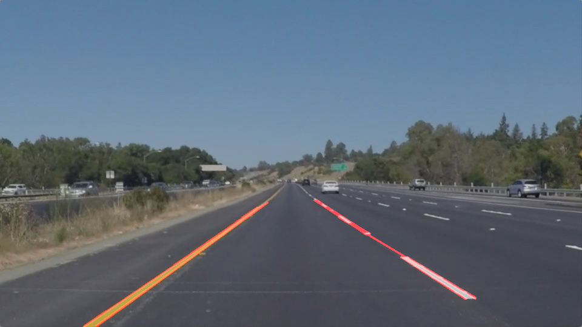

#**Finding Lane Lines on the Road** 

---
## Goal & Steps
The goals / steps of this project are the following:
* Make a pipeline that finds lane lines on the road
* Test the pipeline on test images
* Test the pipeline on test videos
* Test the pipeline on challenge video and make adjustments

---

## Reflection

### Pipeline description

* Convert the image to grayscale
* Apply Gaussian blur 
* Apply Canny edge detection
* Mask out edges image with region of interests
* Apply Hough algorithm on the masked edge detected image to obtain line segments.
* Draw the line segments on the original image

### How I modify draw_lines()
* Divide line segments into two groups: left side and right side.  
* For each side, find out the maximum/minimum x and y value among points of all line segments.
* create a new line segment with the corner points found out in previous step.
* append the new line segment to the original line segment array 

### Source
* [ipython notebook](P1_TimWu.ipynb)
 
### Results of test images
* solidWhiteCurve
'
* solidWhiteRight
'
* solidYellowCurve
'
* solidYellowCurve2
'
* solidYellowLeft
'
* whiteCarLaneSwitch
'

### results of test videos
* [white.mp4](white.mp4)(click `View Raw` to download) 
* [yellow.mp4](yellow.mp4)(click `View Raw` to download) 
* [extra.mp4](extra.mp4)(click `View Raw` to download) 

###2. Identify potential shortcomings with your current pipeline
* It can't identify thin lane lines on the far end.
* Corner point calculation is buggy.  It draws random straight line sometimes. 
* It completely fails on the challenge video.

###3. Suggest possible improvements to your pipeline
* Make use of `opencv`'s built-in box-bound function.
* Add some color filters to make it able to handle special road color.
